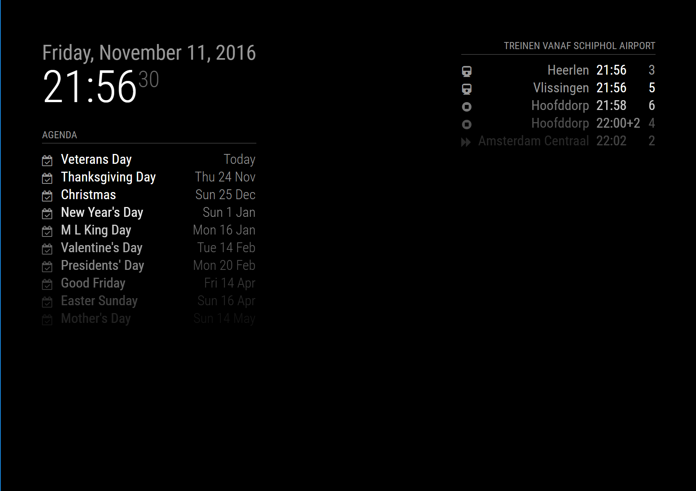

# NS Trains - MagicMirror² module

This is a module for [MagicMirror²](https://github.com/MichMich/MagicMirror). Shows informantion on trains departuring a configurable Dutch trainstation.



## Installing the module

To install the module, just clone this repository to your __modules__ folder: `git clone https://github.com/qistoph/nstreinen.git nstreinen`.
The run `cd nstreinen` and `npm install` to install the dependencies.

## Using the module

You will need a username and password for the NS-API. These can be requested at http://www.ns.nl/reisinformatie/ns-api.

To use this module, add it to the modules array in the `config/config.js` file:
```javascript
modules: [
	{
		module: 'nstreinen',
		position: 'top_right',
		header: 'Treinen vanaf Schiphol Airport',
		config: {
			user:'<NS-API-username>',
			pass: '<NS-API-password>',
			station: 'Schiphol Airport'
		}
	}
]
```

## Configuration options

The following properties can be configured:

<table width="100%">
	<thead>
		<tr>
			<th>Option</th>
			<th width="100%">Description</th>
		</tr>
	</thead>
	<tbody>
		<tr>
			<td><code>user</code></td>
			<td>Your API username. Most likely in the form of an e-mailaddress.<br>
			<br>Request your credentials at http://www.ns.nl/reisinformatie/ns-api
			<br><b>Required</b></td>
		</tr>
		<tr>
			<td><code>pass</code></td>
			<td>Your API password.<br>
			<br><b>Required</b></td>
		</tr>
		<tr>
			<td><code>station</code></td>
			<td>The station to show trains for.<br>
			<br><b>Required</b></td>
		</tr>
		<tr>
			<td><code>maxEntries</code></td>
			<td>Maximum number of trains to show per station.<br>
			<br><b>Default value:</b> <code>5</code></td>
		</tr>
		<tr>
			<td><code>reloadInterval</code></td>
			<td>Number of milliseconds between refresh.<br>
			<br>Keep in mind there is a maximum of 50.000 requests per day for the API.
			<br><b>Default value:</b> <code>5 * 60 * 1000</code> (5 minutes)</td>
		</tr>
		<tr>
			<td><code>displaySymbol</code></td>
			<td>Defines wether or not to show a symbol for each line.<br>
			<br><b>Possible values:</b> <code>true</code> or <code>false</code>.
			<br><b>Default value:</b> <code>true</code></td>
		</tr>
		<tr>
			<td><code>symbolMapping</code></td>
			<td>Maps the train types to the symbol to show.<br>
			<br>If the train type is not found, the symbol for <code>default</code> is used.
			<br><b>Possible symbols:</b> See <a href="http://fontawesome.io/icons/" target="_blank">Font Awsome</a> website.
			<br><b>Default value:</b><br><pre><code>symbolMapping: {
	'Intercity': 'train',
	'Intercity direct': 'forward',
	'Sprinter': 'stop-circle',
	'Stopbus i.p.v. trein': 'bus',
	'Snelbus i.p.v. trein': 'bus',
	'default': 'train'
}</pre></code>
			</td>
		</tr>
		<tr>
			<td><code>fade</code></td>
			<td>Fade the trains listed to black. (Gradient)<br>
				<br><b>Possible values:</b> <code>true</code> or <code>false</code>
				<br><b>Default value:</b> <code>true</code>
			</td>
		</tr>
		<tr>
			<td><code>fadePoint</code></td>
			<td>Where to start fade?<br>
				<br><b>Possible values:</b> <code>0</code> (top of the list) - <code>1</code> (bottom of list)
				<br><b>Default value:</b> <code>0.25</code>
			</td>
		</tr>
	</tbody>
</table>
